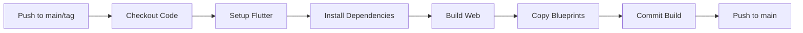

# GitHub Actions - Build Workflow

Este directorio contiene los workflows de GitHub Actions para automatizar el build de la aplicación web.

## 📋 Workflows Disponibles

### `deploy-web.yml` - Build Automático de Web

Construye automáticamente la aplicación web de ejemplo y commitea el resultado.

#### ¿Cuándo se ejecuta?

- ✅ En cada push a la rama `main`
- ✅ En cada tag que sigue el patrón `v*.*.*` (ej: `v2.0.0`)

#### ¿Qué hace?

1. **Construye la app web** - Ejecuta `flutter build web --release` en el directorio `example/`
2. **Copia blueprints** - Copia archivos de configuración desde `example/blueprints/` a `example/build/web/`:
   - `package.json` - Configuración de Node.js
   - `app.js` - Servidor Express
   - `nixpacks.toml` - Configuración para deployment
   - `version.json` - Información de versión (si existe)
3. **Commitea los cambios** - Hace commit del build a la rama `main` del mismo repositorio

## 🔧 Configuración

### No requiere configuración adicional

El workflow usa `GITHUB_TOKEN` que está disponible automáticamente en GitHub Actions.

### Variables de Entorno

En el archivo `deploy-web.yml`, estas variables controlan el proceso:

```yaml
env:
  BUILD_DIR: example/build/web          # Dónde Flutter construye la web
  BLUEPRINTS_DIR: example/blueprints    # Dónde están los archivos de config
```

## 🚀 Uso

### Build Automático (Push a main)

```bash
git add .
git commit -m "Update example app"
git push origin main
```

El workflow se ejecutará automáticamente y commitará el build actualizado.

### Build con Tag (Release)

```bash
# Crear y pushear un tag
git tag -a v2.0.0 -m "Release version 2.0.0"
git push origin v2.0.0
```

Esto ejecutará el workflow y el commit incluirá la versión en el mensaje.

### Verificar el Build

1. Ve a Actions en GitHub
2. Busca el workflow "Build Flutter Web Example"
3. Click en la ejecución más reciente para ver logs
4. Verifica que todos los pasos estén ✅

## 📦 Archivos Generados

El build se commitea en `example/build/web/` con esta estructura:

```
example/build/web/
├── index.html                 # Flutter web app
├── flutter.js                 # Flutter engine
├── main.dart.js               # App compilado
├── assets/                    # Assets de la app
├── canvaskit/                 # CanvasKit (si se usa)
├── package.json              # ← Desde blueprints
├── app.js                    # ← Desde blueprints
├── nixpacks.toml             # ← Desde blueprints
└── version.json              # ← Desde blueprints (opcional)
```

## 🐛 Troubleshooting

### Error: "Failed to build web"

- ✅ Verifica que `example/pubspec.yaml` no tenga errores
- ✅ Verifica que `flutter pub get` funcione localmente
- ✅ Revisa los logs del workflow para errores específicos

### No se copian los archivos de blueprints

- ✅ Verifica que exista el directorio `example/blueprints/`
- ✅ Verifica que los archivos existan: `package.json`, `app.js`, `nixpacks.toml`

### No se hace commit del build

- ✅ Verifica que `example/build/web` no esté en `.gitignore` (debe estar excluido con `!/build/web/`)

## 📝 Notas

- Los archivos de blueprints se copian **después** del build de Flutter
- El build se commitea en la **misma rama** (`main`)
- El mensaje de commit incluye la versión o hash del commit

## 🔄 Flujo Completo



---

**¿Preguntas o problemas?** Abre un issue en el repositorio.

